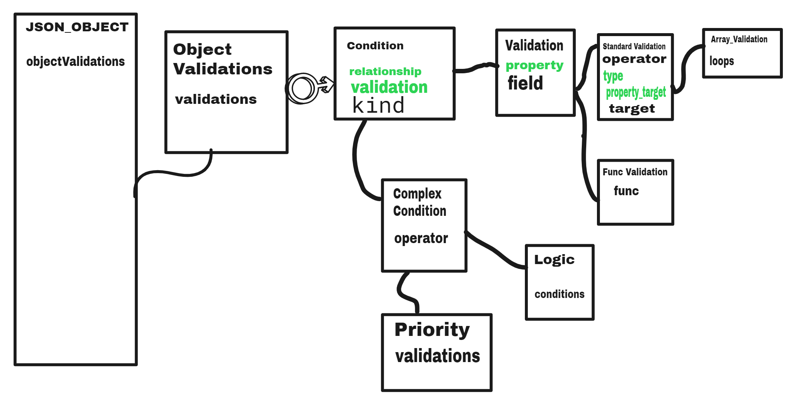

# TypeScript - JSONValidateInterpreter

Essa biblioteca está sendo reformulada para o typescript. Contudo, o seu intuito permanece o mesmo: realizar validações a partir de um JSON. 

## Como funciona

Para ela funcionar, você irá precisar de duas coisas: um objeto a ser validado e um JSON que irá realizar as validações desse objeto. Nesse caso, tanto um objeto literal quanto um objeto construído a partir das classes do ES6 irá funcionar. Contudo, minha recomendação é realizar a construção desse objeto de maneira literal, pois essa estrutura poderá ser mexida diversas vezes durante o percurso de validações.

Primeiro, você irá precisar ter esse JSON em mãos na forma de um objeto javascript. Por isso, você precisa obtê-lo de alguma forma e parseá-lo. Depois disso, basta passar os dois objetos para o interpretador que ele irá lidar com isso.

Existem, também, alguns poréns na hora de criar essas validações:
<ul>
    <li> Em relação aos erros, o interpretador não bloqueia as outras condições. Logo, qualquer erro previsto, será armazenado e disponibilizado para você no final das validações. Com isso, as validações não são interrompidas caso haja alguma validação escrita de modo errôneo.</li>
    <li> Tenha em mente que os campos precisam existir previamente ao acontecimento de sua validação. Logo, caso na hora da validação de determinado campo ele não exista, umn erro será dado. </li>
    <li> Na biblioteca inicial, havia uma funcionalidade que possibilitava a criação de campos em tempo de execução construída dentro do interpretador. Contudo, isso será delegado a outro arquivo e, por enquanto, ainda não há essa funcionalidade na biblioteca. </li>
</ul>

## Escrevendo as validações

As validações precisam ter um formato específico que será entendido pelo validador. Com isso, detalharei abaixo como fazê-lo. Entretanto, irei explicar como que passei esse formato de ifs e elses para a minha cabeça. Logo, já adianto que utilizei bastante de orientação a objeto e que é um pre - requesito para entendê-lo.

## O que são as validações?

As validações são, em essência, if's que retornaram true ou false dependendo dos valores passados. A partir disso, você pode fazer oque quiser com o resultado. Ademias, ainda não há a possibilidade de determinar algum "else" para determinada condição. Por isso, caso deseje esse tipo de fluxo, você precisa fazer na mão uma validação que contemple a situação não atendida.

Dito isso, vamos partir para o entendimento da estrutura. 

## Condições como objeto.

Durante toda a estrutura, iremos tratar os "if's" como objetos, onde existem 3 propriedades básicas: kind, field, target e operator. O field representa o campo da esturutra que está sendo validada, o target é o valor que será comparado ao field e, por fim, o operator é o operador que irá regular a comparação executada entre field e target. Além disso, também foi adicionado a propriedade KIND. Ela indica o tipo de validação que iremos realizar.

<pre>
{
    "nome_validacao": {
        validations:[
            {
                "kind": "tipodevalidacao"
                "field": "nomedocampo",
                "operator": "operador",
                "target": "alvo"
            }
        ]
    }
}

</pre>

Primeiramente, devemos abrir chaves para indicar um objeto. Depois disso, declaramos uma propriedade "nome_validacao". Essa propriedade será usada para nomear o resultado de todas as validações realizadas dentro de validations. Por isso, recomendo nomeâ-la com o seguinte padrão: nome_do_objeto_sendo_validado_campoSendoValidado_ResultadoEsperado.

Dentro desse objeto, iremos declarar uma propriedade validations. Essa propriedade conterá um array. Esse array irá conter uma lista sequencial que seguirá uma ordem de first-in first-out. Além disso, cada objeto dentro desse array será uma validação em si, ou seja, um "if". Logo, caso você vá somente até esse ponto, você terá isso:

<pre>

if() {

}

</pre>

Para escrever as validações, você precisa preencher esses objetos - como foi feito no exemplo acima.

## Operadores disponíveis

Atualmente, os seguintes operadores estão disponíveis para uso:

<ul>
    <li>== - equal</li>
    <li>!= - diff</li>
    <li>> - bigger </li>
    <li>< - smaller> </li>
    <li>>= - biggerequal </li>
    <li><= - smallerequal </li>
    <li>=== - strictequal </li>
    <li>!== - strictdiff </li>
</ul>
 
<strong><i>NOTA</i>: Para usar os comparadores estritos, você precisa determinar o tipo do target através da propriedade "type"</strong>
 

## Tipos para conversão disponíveis

Atualmente, esses são os seguintes tipos disponíveis para conversão:

<ul>
    <li>Number</li>
    <li>Boolean</li>
    <li>String</li>
</ul>
 
<strong><i>NOTA</i>: Para converter um campo target para false, você pode digitar 'false', false ou "". Além disso, para converter para true, você só precisa digitar um campo preenchido e especificar o tipo para Boolean.</strong>
 

## Acessando propriedades:

Para acessar as proprieades de um campo determinado pelo field, você deverá utilziar a propriedade: "property". Ela será um array que conterá todas as propriedades que serão acessadas. Entretanto, você deve ter em mente que esse acesso será feito na ordem de inserção. Logo, preste muita atenção na ordem.

<pre>
{
    "nome_validacao": {
        validations:[
            {
                "kind": "tipo"
                "field": "nomedocampo",
                "property": [
                    "propriedade",
                    "propriedade"
                ]
                "operator": "operador",
                "target": "alvo"
            }
        ]
    }
}

</pre>

Para acessar as propriedades do campo target, você deverá fazer o mesmo especificado acima. Contudo, o nome da propriedade é "property_target".

 
<strong><i>NOTA</i>: As propriedades a serem executadas podem ser tanto propriedades comuns quanto métodos.</strong>
 

## Relacionamentos

Até agora sabemos como fazer validações que utilizam somente um if muito cru e simples. Contudo, muitas vezes, desejamos que uma validação abranja mais de uma situação ou possibilidade. Para contemplar isso, iremos usar o relacionamento. Ele especifica qual a relação de uma validação com a próxima. A partir disso, podemos fazer o seguinte:

<pre>
"nome_validacao": {
        validations:[
            {
                "kind": "tipo",
                "relationship": "relacionamento",
                "field": "nomedocampo",
                "property": [
                    "propriedade",
                    "propriedade"
                ]
                "operator": "operador",
                "target": "alvo"
            },
            {
                 "field": "nomedocampo",
                "property": [
                    "propriedade",
                    "propriedade"
                ]
                "operator": "operador",
                "target": "alvo"
            }
        ]
    }
</pre>

Perceba que o relationship especifica o relacionamento dele mesmo com o próximo. Por isso, uma mesma validação pode ter um relacionamento anterior de um tipo e um relacionamento de outro tipo com a validação posterior.

<pre>
"nome_validacao": {
        validations:[
            {
                "kind": "tipo",
                "relationship": "relacionamento",
                "field": "nomedocampo",
                "property": [
                    "propriedade",
                    "propriedade"
                ]
                "operator": "operador",
                "target": "alvo"
            },
            {
                "kind": "tipo",
                "relationship": "relacionamentoDeOutroTipo",
                 "field": "nomedocampo",
                "property": [
                    "propriedade",
                    "propriedade"
                ]
                "operator": "operador",
                "target": "alvo"
            },
            {
                "kind": "tipo",
                 "field": "nomedocampo",
                "property": [
                    "propriedade",
                    "propriedade"
                ]
                "operator": "operador",
                "target": "alvo"
            }
        ]
    }
</pre>

Na prática, isso representa:

<pre>
    if(nomedocampo operator alvo relacionamento nomedocampo operator alvo ) {

    }
</pre>

Os tipos de relacionamento são esses:

<ul>
    <li> and - && </li>
    <li> or - || </li>
</ul>

 
<strong><i>NOTA</i>: A última validação não deve ter um relacionamento.</strong>
 

## Segunda forma de implementar os relacionamentos

Essa segunda forma de implementação permite um resultado mais rápido, porém te limita na hora de escolher o relacionamento entre as condições. 

Essa segunda forma te permite estabelecer um mesmo relacionamento para um conjunto de condições. Para fazer isso, usaremos o seguinte formato:

<pre>
{
    "kind": "Logic",
    "operator": "relacionamento",
    "condition1:" {
        "field": "nomedocampo",
        "property": [
            "propriedade",
            "propriedade"
        ],
        "operator": "operador",
        "target": "alvo"
    },
    "condition2:" {
        "field": "nomedocampo",
        "property": [
            "propriedade",
            "propriedade"
        ],
        "operator": "operador",
        "target": "alvo"
    }

}
</pre>

O relacionamento se aplica da mesma forma, porém você não pode controlar o relacionamento entre cada uma das condições.

 
<strong><i>NOTA</i>: Adicionar a propriedade relationship irá causar um erro.</strong>
<strong><i>OBS</i>: A presença da propriedade KIND é obrigatória.</strong>
 

## Kind

Essa propriedade foi adicionada recentemente com o intuito de facilitar o entendimento dos tipos de validação e, também, a implementação de novas validações. Com isso, ela passa a ser obrigatória em todas as validações. 

Atualmente, existem alguns tipos de validação:

<ul>
    <li>Standard</li>
    <li>Array</li>
    <li>Func</li>
    <li>Priority</li>Logic
    <li>Logic</li>
</ul>

Algumas, vocês já viram, como a Standard e a Logic. Entretanto, as outras serão mais explicadas no decorrer da documentação. Ademais, caso queira um entendimento maior da árvore de herança das condições a partir do JSON, basta ver a imagem abaixo:

=> Os campos em verde são propriedades opicionais. 
=> As linhas pretas representam a herança de um elemento pai para seu elemento filho. 
=> A imagem deve ser lida da esquerda para direita. 
=> A relação entre objectValidations e Condtions é através da propriedade validations, que é um array de conditions.